# Blog App with Next.js and Firebase

Welcome to the Blog App repository! This project is a Next.js-based web application designed to serve as a platform for users to create, publish, and explore blog posts. Built with Next.js and Firebase, it includes user authentication using NextAuth.js and allows users to upload images for their posts. The app features a modern UI design with both dark and light themes for an enhanced user experience.

## Preview

### 1. Desktop Review

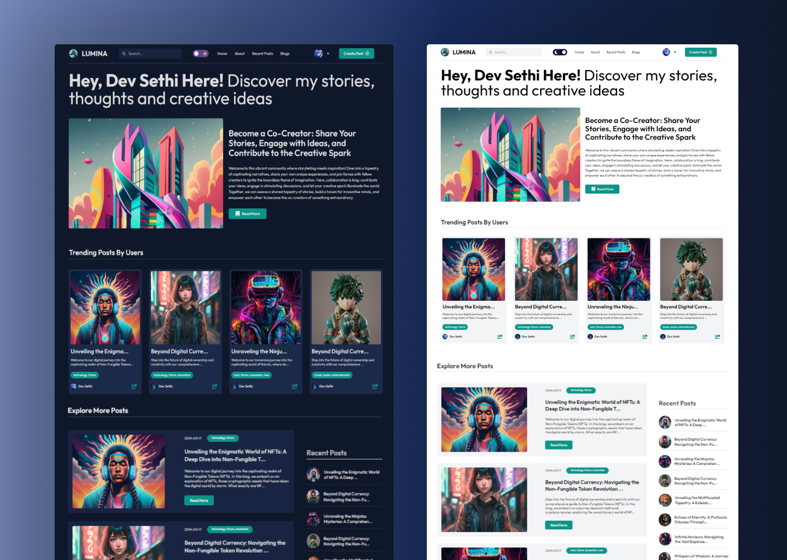

### 2. Create Post and Publish

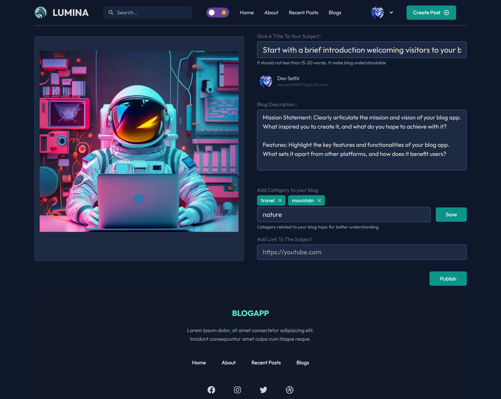

### 3. Error Handling for Essential Details

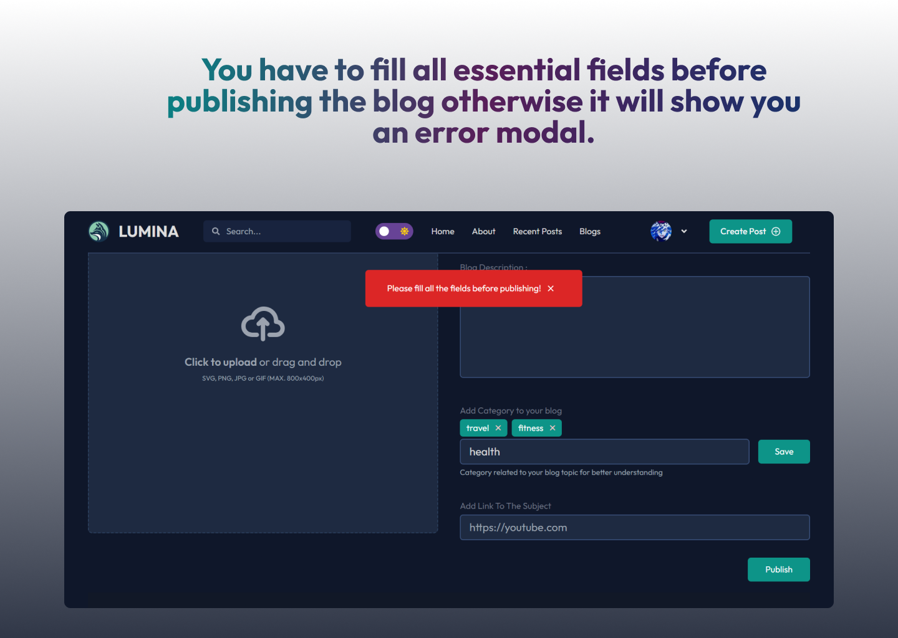

### 4. Delete Post

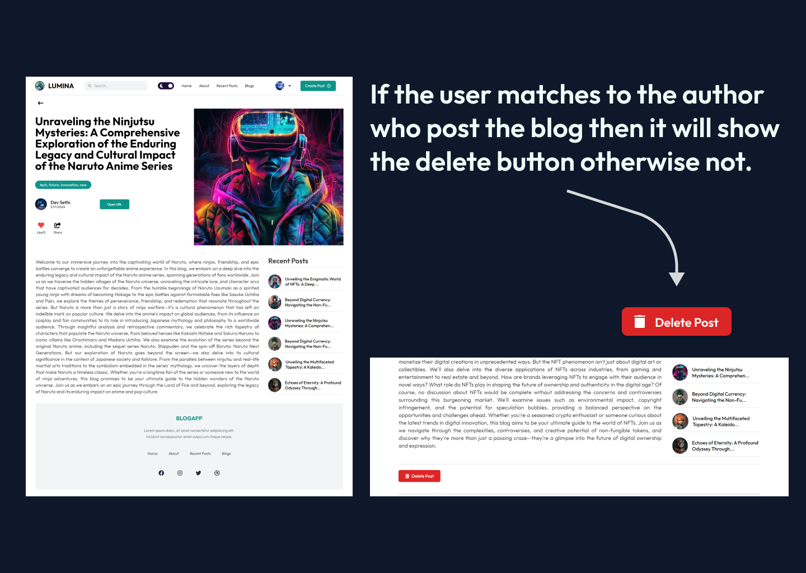

### 4. Edit Post

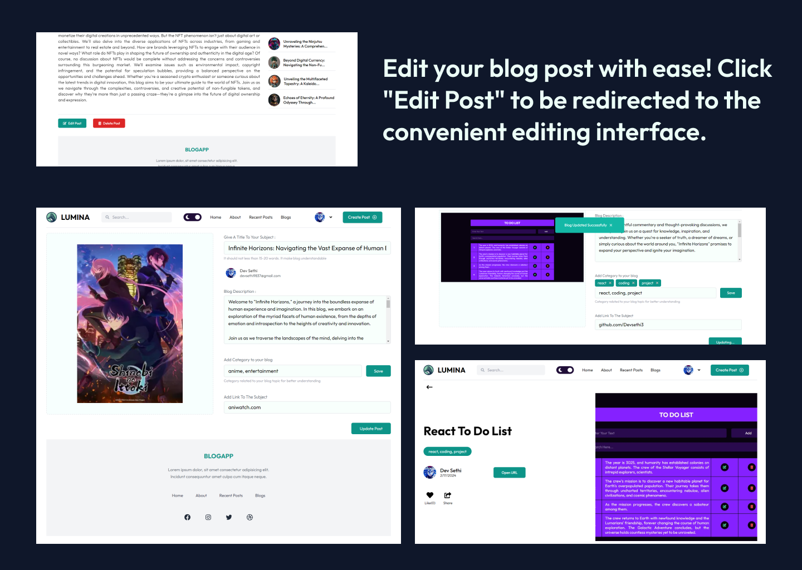

### 4. Search Filter

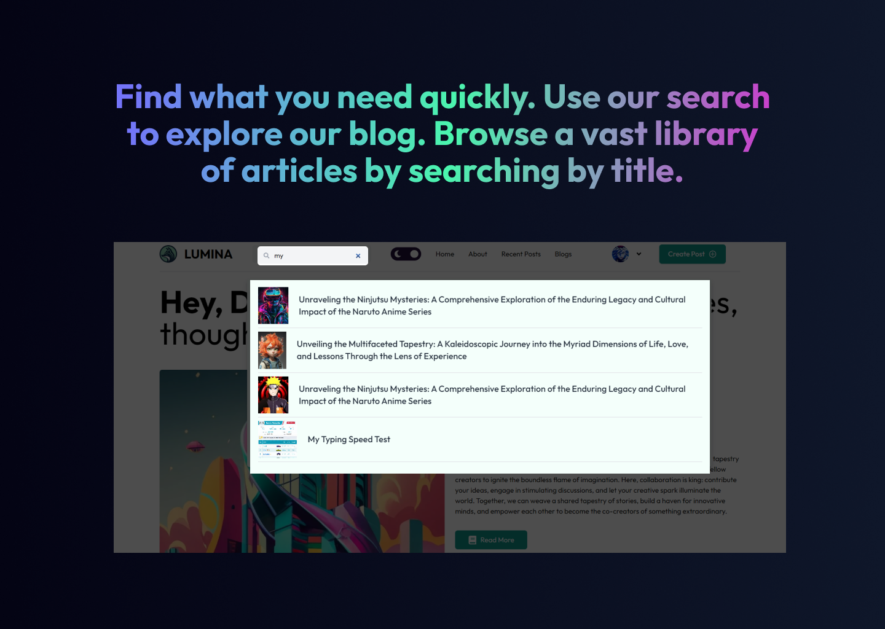

### 5. Authentication

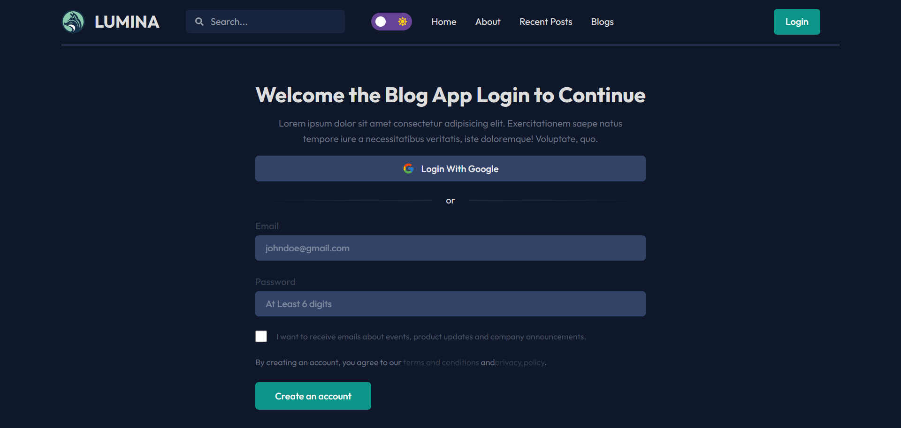

### 6. Single Post Page

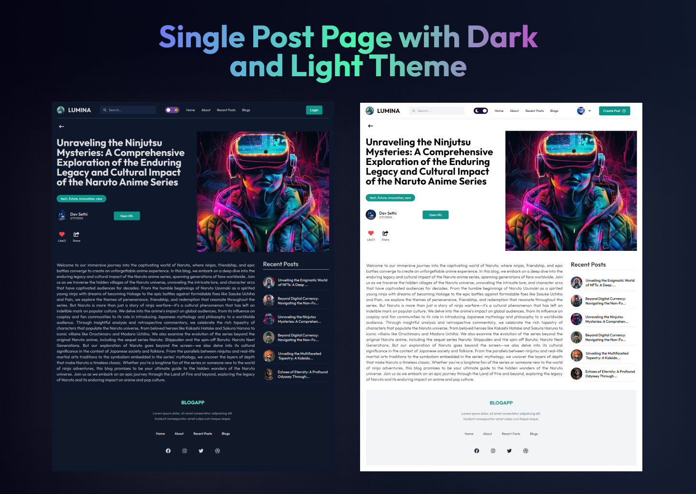

### 7. User Page with Data and Posts

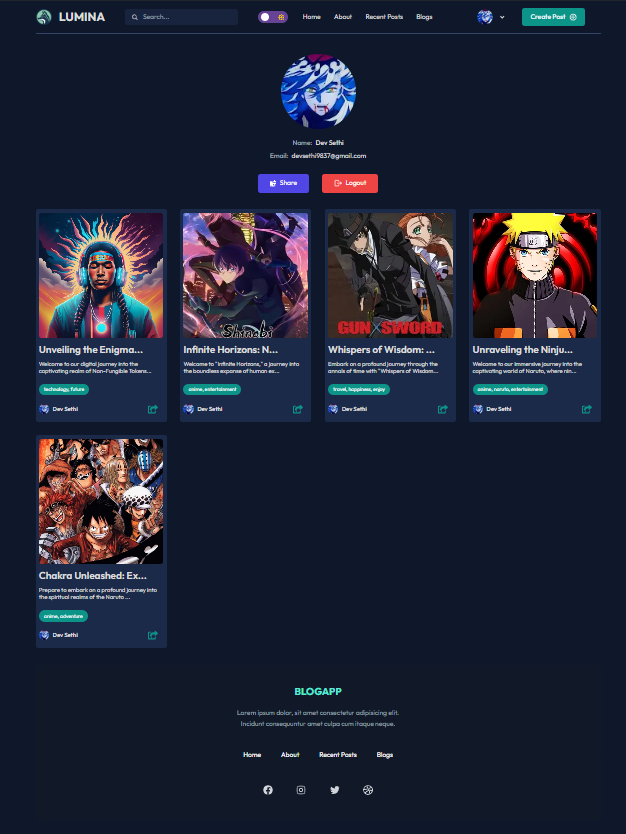

### 8. Recent Posts with Table

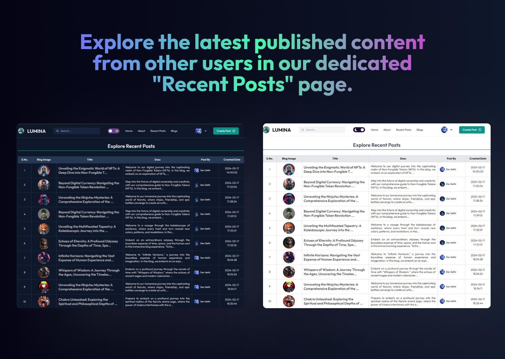

### 9. Explore All Blogs Section

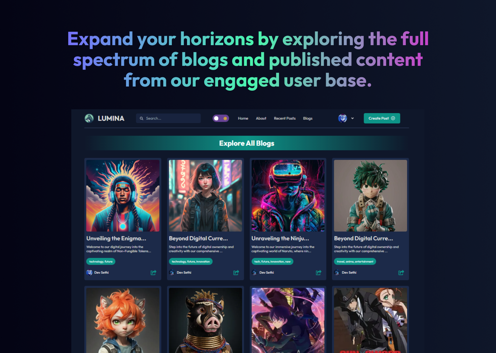

## Features

- **User Authentication:** Login and register using NextAuth.js for secure authentication.
- **Post Management:** Create, publish, and delete blog posts with image uploads.
- **Profile Page:** View user-specific data and posts on the profile page.
- **Recent Posts:** Display recent posts in a table format for easy access.
- **Explore All Blogs:** Explore published content from other users.
- **Dark and Light Themes:** Switch between dark and light themes for user preference.
- **Modern UI Design:** Sleek layout and visually appealing design for an enjoyable user interface.

## Demo

Check out the live demo of the Blog App [here](https://next-js-blog-eyrj1cbzq-devsethi3s-projects.vercel.app).

## Getting Started

To run the Blog App locally, follow these steps:

1. Clone the repository to your local machine:

   ```bash
   git clone https://github.com/Devsethi3/Next-JS-Firebase-Blog-App .git
   ```

2. Navigate to the project directory:

   ```bash
   cd blog-app
   ```

3. Install the dependencies:

   ```bash
   npm install
   ```

4. Start the development server:

   ```bash
   npm run dev
   ```

5. Open your web browser and visit [http://localhost:3000](http://localhost:3000) to use the app.

## Usage

1. Login or register using the authentication feature.
2. Create and publish blog posts with images.
3. View and manage your posts on the profile page.
4. Explore recent posts and content from other users.
5. Enjoy the modern UI design with dark and light themes.

## Customization

Feel free to customize this project to fit your preferences. Update styles, colors, and layout in the Next.js components and CSS files. You can also extend the functionality to include additional features or customization options.

## Contributing

If you'd like to contribute to this project, please follow these steps:

1. Fork the repository.
2. Create a new branch for your feature or improvement.
3. Make your changes and commit them with descriptive messages.
4. Push your changes to your forked repository.
5. Open a pull request to merge your changes into the main branch.

Explore the Blog App, create and explore blog posts, and consider contributing to its development. Thank you for checking out the repository!
